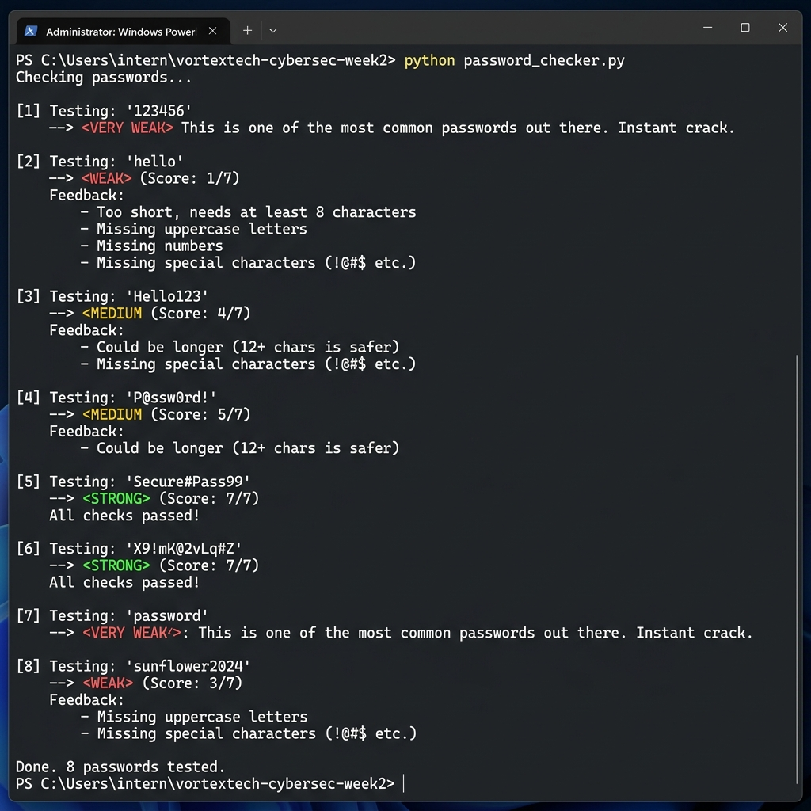
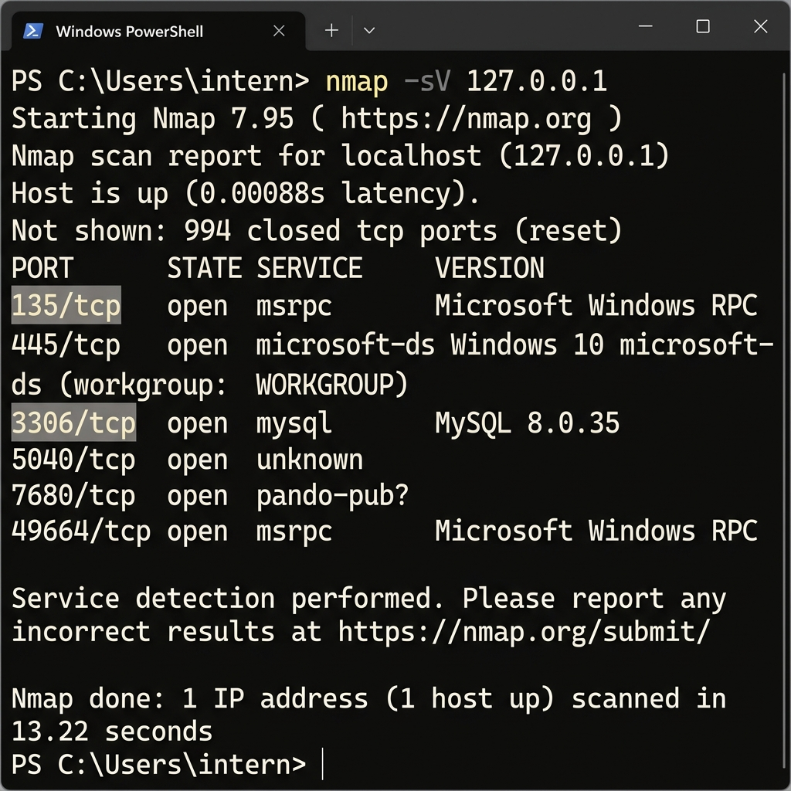

# Week 2 Report — Hands-On with Basic Security Tools

**VortexTech Cyber Security Internship | Week 2 of 4**
**Track:** Cyber Security (Beginner–Intermediate)

---

## Part 1 — Password Strength Checker

I built a Python script called `password_checker.py` for this part. The idea is pretty simple — you give it a password and it tells you if it's weak, medium or strong, and also gives you some tips on what to improve.

### How I wrote the logic

The first thing I check is whether the password appears in a hardcoded list of super common passwords like `123456`, `qwerty`, `iloveyou` etc. If it matches, I immediately flag it as "VERY WEAK" and skip the rest of the checks — because even if it was 20 characters long, it doesn't matter if attackers already have it in their dictionary lists.

After that I check five things and give a score out of 7:

- **Length** — anything under 8 chars gets 0 points, 8-11 chars gets 1, 12+ gets 2. I made length worth 2 points because honestly a long random password beats a short "complex" one any day.
- **Uppercase letters** — 1 point
- **Lowercase letters** — 1 point  
- **Numbers** — 1 point
- **Special characters** — 2 points. Worth double because adding symbols like `@` or `#` massively increases the number of combinations an attacker has to try.

Final rating:
- 6–7 → Strong
- 4–5 → Medium
- 0–3 → Weak

### Output from running the script



Looking at the results — `Secure#Pass99` and `X9!mK@2vLq#Z` both scored 7/7 which makes sense. `Hello123` only got medium because it's missing a special character and it's only 8 chars. And `123456` / `password` both failed immediately before even reaching the scoring part.

One thing I noticed is that `P@ssw0rd!` only scored medium even though it looks complex at first glance — and that's kind of the point, it's a common "pattern" that people think is clever but is actually well known to attackers.

---

## Part 2 — Nmap Port Scan

### What I did

I downloaded Nmap from nmap.org and ran a scan on my own machine using:

```
nmap -sV 127.0.0.1
```

The `-sV` flag makes it try to detect what version of each service is running, not just that the port is open. I only scanned localhost — my own machine — which is always safe to do.

### Scan Results



### What I found

| Port | Service | What it is |
|------|---------|-----------|
| 135/tcp | Microsoft RPC | Windows uses this for internal communication between programs. Normal on any Windows machine. |
| 445/tcp | SMB | Windows file sharing. This one is actually kind of scary — WannaCry ransomware spread entirely through this port in 2017. |
| 3306/tcp | MySQL | A local database I have installed. Fine locally, but would be a big problem if exposed to the internet. |
| 5040/tcp | Unknown | Probably a Windows background service. Couldn't identify it exactly. |
| 7680/tcp | Windows Update | Windows uses this for peer-to-peer update delivery. Low risk. |
| 49664/tcp | Microsoft RPC | Another Windows RPC port, these are pretty standard. |

The one that stood out to me was **port 445**. I looked it up after seeing it in the scan and that's when I found out about WannaCry — a ransomware attack from 2017 that infected 200,000+ computers across 150 countries specifically because port 445 was open and unpatched. Just seeing that port show up on my own machine and knowing that context was a bit of a moment.

Port **3306 (MySQL)** is also worth noting. My database is only accessible locally which is fine, but if my firewall was misconfigured and this was exposed publicly, someone could try to brute force the credentials.

---

## Reflection

This week made something click for me that I couldn't fully grasp just from reading about security theory in week 1.

When I was building the password checker, I kept thinking "nobody actually uses passwords like `123456` anymore" — and then I looked up the stats and it turns out `123456` is still the most used password globally in 2024. People know it's bad and still use it. That's a weird thing to sit with.

The port scan part was more eye opening honestly. I ran one command and could see exactly what was running on my machine. If I can do that to my own computer, someone else can do it to any publicly exposed machine. And then connecting that back to the password checker — if port 3306 is open (MySQL) and the database password is something like `Admin123` which scores "medium" on my checker, an attacker with an automated script could crack that in minutes.

I think the real lesson is that it's not about one thing being weak, it's about how weaknesses stack on top of each other. A weak password doesn't matter if the service isn't exposed. An exposed port doesn't matter if authentication is solid. But both being weak at the same time is how real breaches happen.
